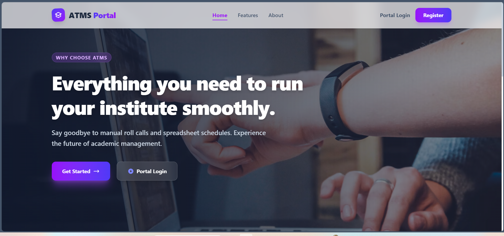
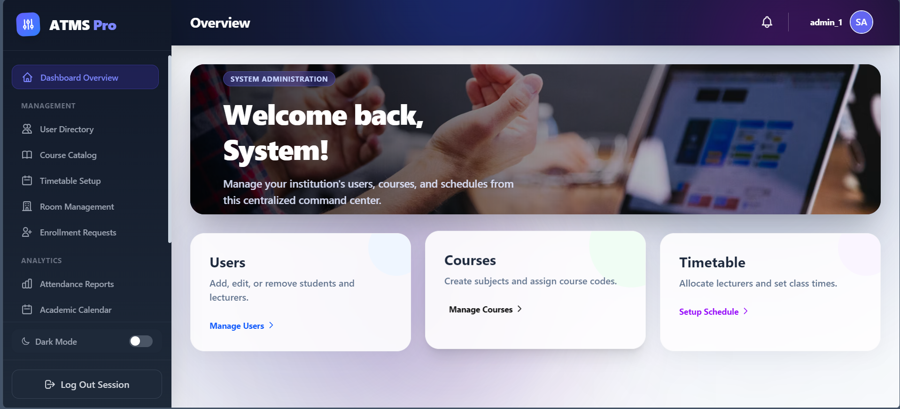
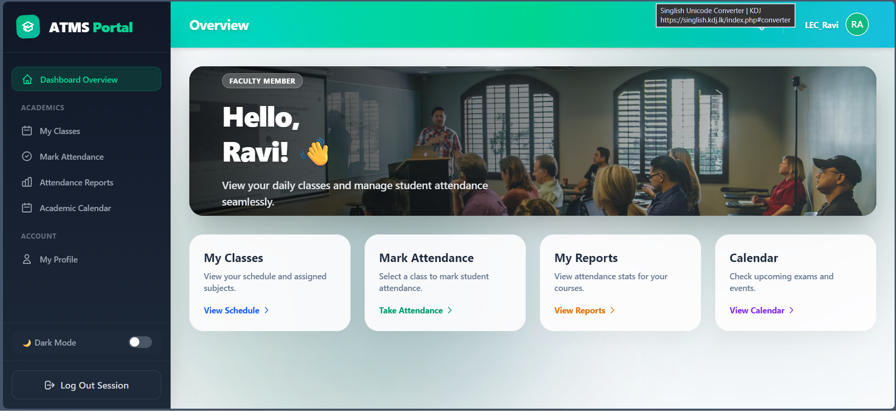
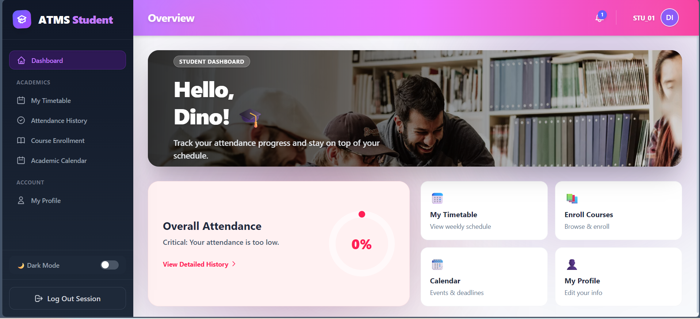
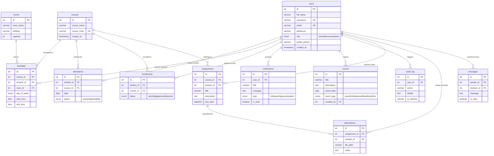

<div align="center">

  

  # 🎓 ATMS — Attendance & Timetable Management System

  ### A Full-Stack Academic Management Platform for Modern Educational Institutes

  <br/>

  <p>
    <a href="https://reactjs.org/"></a>
    <a href="https://vitejs.dev/"></a>
    <a href="https://tailwindcss.com/"></a>
    <a href="https://www.php.net/"></a>
    <a href="https://www.mysql.com/"></a>
    <a href="https://axios-http.com/"></a>
  </p>

  <p>
    
    
    
    
  </p>

  <p>
    <a href="#-overview">Overview</a> · 
    <a href="#-screenshots">Screenshots</a> · 
    <a href="#-features">Features</a> · 
    <a href="#%EF%B8%8F-architecture">Architecture</a> · 
    <a href="#-database-schema">Database</a> · 
    <a href="#-api-reference">API</a> · 
    <a href="#%EF%B8%8F-installation--setup">Setup</a> · 
    <a href="#-contributing">Contributing</a> · 
    <a href="#-author">Author</a>
  </p>

</div>

<br/>

---

## 📖 Overview

> **Say goodbye to manual roll calls and spreadsheet schedules. Experience the future of academic management.**

**ATMS** (Attendance & Timetable Management System) is a comprehensive, role-based web application designed to digitise and streamline core academic operations — from attendance tracking and timetable scheduling to course management and institutional analytics.

Built with a **React + Vite** frontend and a **PHP / MySQL** REST API backend, ATMS delivers dedicated dashboards for three user roles — **Administrator**, **Lecturer**, and **Student** — each with tailored functionality, real-time data, and a polished, responsive UI featuring **dark mode support**, **glassmorphism aesthetics**, and **micro-interactions**.

### Why ATMS?

| Problem | ATMS Solution |
|---|---|
| Manual paper-based attendance | Digital mark sheets with real-time percentage tracking |
| Spreadsheet timetables prone to conflicts | Smart scheduling with room & lecturer allocation |
| No centralized course enrollment | Self-service enrollment with admin approval workflows |
| Scattered communication | Integrated notification system for all roles |
| Zero audit trail | Full audit logging of system activities |

---

## 📸 Screenshots

<details open>
<summary><b>🏠 Landing Page & Portal</b></summary>
<br/>

A sleek, modern landing page with hero carousel, feature highlights, and smooth navigation to login/register flows.

<p align="center">
  
</p>
</details>

<details open>
<summary><b>🛡️ Administrator Dashboard</b></summary>
<br/>

Full institutional control — manage users, courses, timetables, rooms, enrollment requests, attendance reports, academic calendar, and system audit logs from a centralized command center.

<p align="center">
  
</p>
</details>

<details open>
<summary><b>👨‍🏫 Lecturer Dashboard</b></summary>
<br/>

Dedicated faculty workspace to view assigned classes, mark student attendance, generate course reports, and manage academic calendar events.

<p align="center">
  
</p>
</details>

<details open>
<summary><b>🎓 Student Dashboard</b></summary>
<br/>

Interactive student portal with real-time attendance percentage (circular progress indicator), weekly timetable view, course enrollment, and notification center.

<p align="center">
  
</p>
</details>

---

## ✨ Features

### 🔐 Authentication & Authorization
- Secure login and registration with password hashing
- Role-based access control (**Admin**, **Lecturer**, **Student**)
- Session management with automatic route protection
- Password change functionality with validation
- Dynamic avatar generation via `ui-avatars` API

### 🛡️ Admin Panel
| Module | Description |
|---|---|
| **User Directory** | Full CRUD operations — add, edit, delete users across all roles |
| **Course Catalog** | Create and manage courses with unique course codes |
| **Timetable Setup** | Schedule classes by day, time, lecturer, and room |
| **Room Management** | Manage lecture halls with building info and capacity tracking |
| **Enrollment Requests** | Approve or reject student enrollment applications |
| **Attendance Reports** | Institution-wide reports with course-level and student-level breakdowns |
| **Academic Calendar** | Manage exams, holidays, deadlines, and events |
| **Send Notifications** | Broadcast system-wide or targeted notifications |
| **Audit Log** | Track all system activities with timestamps and IP addresses |
| **Dark Mode** | System-wide theme toggle persisted in local storage |

### 👨‍🏫 Lecturer Panel
| Module | Description |
|---|---|
| **My Classes** | View assigned schedule with course, room, and time details |
| **Mark Attendance** | Interactive student list with present/absent/late toggle controls |
| **Attendance Reports** | Per-course attendance stats for assigned classes |
| **Academic Calendar** | View upcoming exams, events, and deadlines |
| **My Profile** | Edit personal details and change password |

### 🎓 Student Portal
| Module | Description |
|---|---|
| **Dashboard Overview** | Real-time attendance percentage with circular progress indicator |
| **My Timetable** | Weekly schedule with day, time, course, and lecturer details |
| **Attendance History** | Detailed date-wise attendance records across all enrolled courses |
| **Course Enrollment** | Browse available courses and submit enrollment requests |
| **Academic Calendar** | View upcoming exams, events, and deadlines |
| **Notification Center** | Receive and manage system notifications with unread badges |
| **My Profile** | Edit personal info and change password |

### 🎨 UI/UX Highlights
- **Glassmorphism Design** — Frosted glass effects with backdrop blur
- **Dark Mode** — Full dark theme support across all dashboards
- **Responsive Layout** — Sidebar navigation optimized for desktop
- **Micro-Animations** — Smooth hover effects, transitions, and state changes
- **Dynamic Gradients** — Role-specific color theming (Purple/Admin, Teal/Lecturer, Pink-Purple/Student)
- **Smart Notifications** — Real-time unread count badge with 30-second auto-refresh

---

## 🏗️ Architecture

```
┌─────────────────────────────────────────────────────────┐
│                    CLIENT (Browser)                      │
│  ┌───────────────────────────────────────────────────┐   │
│  │            React 19 + Vite (SPA)                  │   │
│  │  ┌──────────┐ ┌───────────┐ ┌────────────────┐   │   │
│  │  │  Pages   │ │Components │ │  State (Hooks) │   │   │
│  │  └──────────┘ └───────────┘ └────────────────┘   │   │
│  │           Tailwind CSS + Dark Mode                │   │
│  └──────────────────────┬────────────────────────────┘   │
│                         │ Axios (HTTP/JSON)               │
└─────────────────────────┼───────────────────────────────┘
                          │
                   ┌──────▼──────┐
                   │  CORS Layer │
                   └──────┬──────┘
                          │
┌─────────────────────────┼───────────────────────────────┐
│               SERVER (Apache / XAMPP)                     │
│  ┌──────────────────────▼────────────────────────────┐   │
│  │           PHP 8.x REST API (29 Endpoints)         │   │
│  │  ┌────────────┐ ┌─────────────┐ ┌─────────────┐  │   │
│  │  │    Auth    │ │    CRUD     │ │  Analytics   │  │   │
│  │  └────────────┘ └─────────────┘ └─────────────┘  │   │
│  │         PDO Prepared Statements (SQL Injection     │   │
│  │                 Prevention)                        │   │
│  └──────────────────────┬────────────────────────────┘   │
│                         │                                 │
│  ┌──────────────────────▼────────────────────────────┐   │
│  │           MySQL / MariaDB (atms_db)               │   │
│  │     12 Tables • Foreign Keys • Indexes            │   │
│  └───────────────────────────────────────────────────┘   │
└─────────────────────────────────────────────────────────┘
```

### Tech Stack

| Layer | Technology | Purpose |
|---|---|---|
| **Frontend** | React 19 (Vite) | Component-based SPA |
| **Styling** | Tailwind CSS | Utility-first responsive design |
| **HTTP Client** | Axios | Promise-based API communication |
| **Backend** | PHP 8.x | RESTful API endpoints |
| **Database** | MySQL / MariaDB | Relational data storage |
| **Server** | Apache (XAMPP) | Local development server |
| **Security** | PDO Prepared Statements | SQL injection prevention |
| **Auth** | bcrypt + Session | Password hashing & session management |

### Project Structure

```
Attendance-timetable-system/
│
├── frontend/                        # React + Vite Application
│   ├── public/
│   │   └── logo.png                 # Application logo
│   ├── src/
│   │   ├── pages/                   # Top-level page components
│   │   │   ├── Home.jsx             # Landing page with hero carousel
│   │   │   ├── AdminDashboard.jsx   # Administrator control panel
│   │   │   ├── LecturerDashboard.jsx# Faculty workspace
│   │   │   └── StudentDashboard.jsx # Student portal
│   │   ├── components/              # Reusable UI components (20+)
│   │   │   ├── Login.jsx            # Authentication form
│   │   │   ├── Register.jsx         # User registration
│   │   │   ├── ManageUsers.jsx      # Admin user CRUD
│   │   │   ├── ManageCourses.jsx    # Course management
│   │   │   ├── TimetableManagement.jsx # Schedule builder
│   │   │   ├── MarkAttendance.jsx   # Attendance marking interface
│   │   │   ├── AttendanceReports.jsx# Report generation
│   │   │   ├── StudentAttendance.jsx# Student attendance view
│   │   │   ├── StudentTimetable.jsx # Student schedule view
│   │   │   ├── CourseEnrollment.jsx  # Enrollment requests
│   │   │   ├── ManageEnrollments.jsx # Admin enrollment mgmt
│   │   │   ├── ManageRooms.jsx      # Room/venue management
│   │   │   ├── AcademicCalendar.jsx # Events & calendar
│   │   │   ├── NotificationPanel.jsx# Notification center
│   │   │   ├── SendNotification.jsx # Admin notification broadcast
│   │   │   ├── ProfileManagement.jsx# Profile editing
│   │   │   ├── AuditLog.jsx         # System activity log
│   │   │   ├── LecturerClasses.jsx  # Lecturer class schedule
│   │   │   ├── LecturerAttendanceReport.jsx
│   │   │   └── Logo.jsx             # Branding component
│   │   ├── App.jsx                  # Root application component
│   │   └── index.css                # Global styles & Tailwind
│   ├── package.json
│   └── vite.config.js
│
├── backend/                         # PHP REST API
│   ├── config/
│   │   └── database.php             # DB connection configuration
│   └── api/                         # API endpoints (29 files)
│       ├── login.php                # POST  – User authentication
│       ├── register.php             # POST  – User registration
│       ├── get_users.php            # GET   – List all users
│       ├── edit_user.php            # POST  – Update user
│       ├── delete_user.php          # POST  – Remove user
│       ├── get_courses.php          # GET   – List courses
│       ├── add_course.php           # POST  – Create course
│       ├── delete_course.php        # POST  – Remove course
│       ├── get_timetable.php        # GET   – Fetch timetable
│       ├── get_student_timetable.php# GET   – Student schedule
│       ├── create_timetable.php     # POST  – Create schedule entry
│       ├── delete_timetable.php     # POST  – Remove schedule
│       ├── save_attendance.php      # POST  – Save attendance data
│       ├── get_attendance.php       # GET   – Fetch attendance
│       ├── get_student_attendance.php# GET  – Student attendance
│       ├── get_attendance_reports.php# GET  – Report generation
│       ├── get_lecturer_classes.php  # GET  – Lecturer schedule
│       ├── get_students.php         # GET   – List students
│       ├── get_dashboard_stats.php  # GET   – Dashboard analytics
│       ├── manage_enrollments.php   # POST  – Enrollment actions
│       ├── manage_rooms.php         # POST  – Room CRUD
│       ├── manage_events.php        # POST  – Calendar events
│       ├── manage_notifications.php # POST  – Notification CRUD
│       ├── get_notifications.php    # GET   – User notifications
│       ├── update_profile.php       # POST  – Profile update
│       ├── change_password.php      # POST  – Password change
│       ├── audit_log.php            # GET   – Audit trail
│       ├── assignments.php          # CRUD  – Assignments
│       └── messages.php             # CRUD  – Direct messages
│
├── screenshots/                     # UI screenshots for README
├── atms_schema.sql                  # V1 database schema
├── atms_schema_v2.sql               # V2 schema extensions
├── .gitignore
└── README.md                        # ← You are here
```

---

## 🗄️ Database Schema

The system uses **12 relational tables** across two schema versions:



---

## 📡 API Reference

All endpoints follow the base URL pattern:

```
http://localhost/Attendance-timetable-system/backend/api/
```

### Authentication

| Method | Endpoint | Description |
|---|---|---|
| `POST` | `/login.php` | Authenticate user credentials |
| `POST` | `/register.php` | Register new user account |
| `POST` | `/change_password.php` | Change user password |

### User Management (Admin)

| Method | Endpoint | Description |
|---|---|---|
| `GET` | `/get_users.php` | List all users |
| `GET` | `/get_students.php` | List all students |
| `POST` | `/edit_user.php` | Update user details |
| `POST` | `/delete_user.php` | Delete a user |
| `POST` | `/update_profile.php` | Update own profile |

### Course Management

| Method | Endpoint | Description |
|---|---|---|
| `GET` | `/get_courses.php` | List all courses |
| `POST` | `/add_course.php` | Create new course |
| `POST` | `/delete_course.php` | Delete a course |

### Timetable & Scheduling

| Method | Endpoint | Description |
|---|---|---|
| `GET` | `/get_timetable.php` | Get full timetable |
| `GET` | `/get_student_timetable.php` | Student's schedule |
| `GET` | `/get_lecturer_classes.php` | Lecturer's classes |
| `POST` | `/create_timetable.php` | Add schedule entry |
| `POST` | `/delete_timetable.php` | Remove schedule entry |

### Attendance

| Method | Endpoint | Description |
|---|---|---|
| `GET` | `/get_attendance.php` | Fetch attendance records |
| `GET` | `/get_student_attendance.php` | Student attendance + percentage |
| `GET` | `/get_attendance_reports.php` | Detailed reports |
| `POST` | `/save_attendance.php` | Mark student attendance |

### Enrollment, Rooms & Events

| Method | Endpoint | Description |
|---|---|---|
| `POST` | `/manage_enrollments.php` | Enrollment CRUD & approval |
| `POST` | `/manage_rooms.php` | Room CRUD operations |
| `POST` | `/manage_events.php` | Calendar event CRUD |

### Notifications & System

| Method | Endpoint | Description |
|---|---|---|
| `GET` | `/get_notifications.php` | User notifications + unread count |
| `POST` | `/manage_notifications.php` | Notification CRUD |
| `GET` | `/get_dashboard_stats.php` | Dashboard analytics |
| `GET` | `/audit_log.php` | System audit trail |

### Assignments & Messages

| Method | Endpoint | Description |
|---|---|---|
| `*` | `/assignments.php` | Assignment CRUD |
| `*` | `/messages.php` | Direct messaging CRUD |

---

## ⚙️ Installation & Setup

### Prerequisites

Ensure the following are installed on your machine:

| Requirement | Version | Download |
|---|---|---|
| **Node.js** | v18+ | [nodejs.org](https://nodejs.org/) |
| **npm** | v9+ | Bundled with Node.js |
| **XAMPP** | Latest | [apachefriends.org](https://www.apachefriends.org/) |
| **Git** | Latest | [git-scm.com](https://git-scm.com/) |

### Step 1 — Clone the Repository

```bash
git clone https://github.com/Tasuntha-Chathunika/Attendance-timetable-system.git
```

### Step 2 — Place in XAMPP

Move or clone the project directly into your XAMPP `htdocs` directory:

```
C:\xampp\htdocs\Attendance-timetable-system\
```

### Step 3 — Database Setup

1. Start **Apache** and **MySQL** from the XAMPP Control Panel
2. Open **phpMyAdmin** at `http://localhost/phpmyadmin`
3. Create a new database named **`atms_db`**
4. Import the schema files **in order**:

```sql
-- Step 1: Import base tables
atms_schema.sql

-- Step 2: Import V2 extensions (notifications, rooms, events, enrollments, etc.)
atms_schema_v2.sql
```

### Step 4 — Backend Configuration

Verify the database connection settings in `backend/config/database.php`:

```php
$host = "localhost";
$dbname = "atms_db";
$username = "root";
$password = "";
```

### Step 5 — Frontend Setup

```bash
cd frontend
npm install
npm run dev
```

### Step 6 — Launch 🚀

| Service | URL |
|---|---|
| **Frontend** | `http://localhost:5173` |
| **Backend API** | `http://localhost/Attendance-timetable-system/backend/api/` |
| **phpMyAdmin** | `http://localhost/phpmyadmin` |

---

## 🔑 Default User Roles

After setting up, register users through the system or insert them directly:

| Role | Access Level |
|---|---|
| **Admin** | Full system control — users, courses, timetables, reports, audit |
| **Lecturer** | View classes, mark attendance, view reports |
| **Student** | View timetable, check attendance, enroll in courses |

---

## 🤝 Contributing

Contributions are welcome! To contribute:

1. **Fork** the repository
2. **Create** a feature branch: `git checkout -b feature/your-feature`
3. **Commit** your changes: `git commit -m "Add your feature"`
4. **Push** to the branch: `git push origin feature/your-feature`
5. **Open** a Pull Request

### Contribution Guidelines

- Follow existing code style and naming conventions
- Write descriptive commit messages
- Test your changes before submitting
- Update documentation if adding new features

---

## 📋 Roadmap

- [ ] Student assignment submission portal
- [ ] Direct messaging system between users
- [ ] Email notification integration
- [ ] PDF report export
- [ ] Mobile-responsive dashboard layouts
- [ ] Two-factor authentication (2FA)
- [ ] Student attendance QR code scanning

---

## 📄 License

This project is licensed under the **MIT License** — see the [LICENSE](LICENSE) file for details.

---

## 👨‍💻 Author

<div align="center">
  

  <br/><br/>

  **Designed & Developed by S.D. Tasuntha Chathunika**

  *Full Stack Developer · UI/UX Enthusiast · Open Source Contributor*

  <br/>

  <a href="https://github.com/Tasuntha-Chathunika"></a>

</div>

---

<p align="center">
  <sub>Built with ❤️ and clean code · © 2026 ATMS Project</sub>
</p>